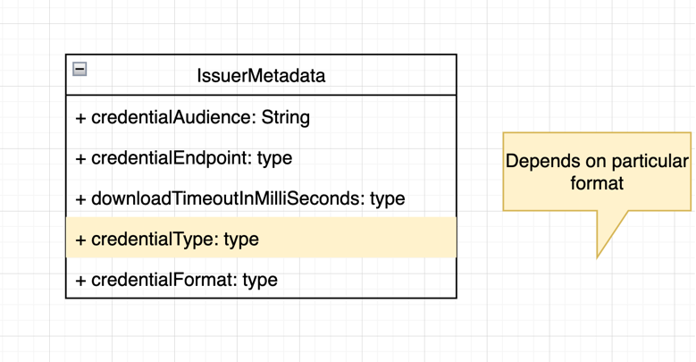

# 2. issuer-meta-data-for-different-vc-formats

Date: 2024-06-27

## Status

Approved - Approach 1

## Consequences of selected approach

We are going with updating issuerMetaData to avoid breaking changes and we will be managing validation based on VC formats

## Context

For making a credential request to download mdoc VC we are required with other details like claims, doctype which are not available in the current IssuerMetaData entity.
For this reason, we are looking for a design that can accommodate the process of credential request based on any VC format in smooth way. 

## Decision

#### Current IssuerMetadata

### Approach 1

Add any newly required properties to the Issuer metadata entity when required, keeping the format related properties as optional.

#### Pros

- Not a breaking change

#### Cons

- This would result in frequent changes to the issuer metadata entity

- We would be required to add more cases or implement validators to make sure no mandatory properties required as per format is missed out

### Approach 2

Create IssuerMetadata interface which holds only the format independent properties and create format specific issuer metadata (say MdocIssuerMetadata) entity inheriting the IssuerMetadata interface, which hold only format dependent properties.

#### Pros

- when any new format is adapted into the library, creating an entity holding required properties and implementing IssuerMetadata would be enough
- Since we are using entities here, we may not be required to add more cases or implement validators to make sure no mandatory properties required as per format is missed out

#### Cons

- Since this is like breaking change the consumers would be required to adapt it

