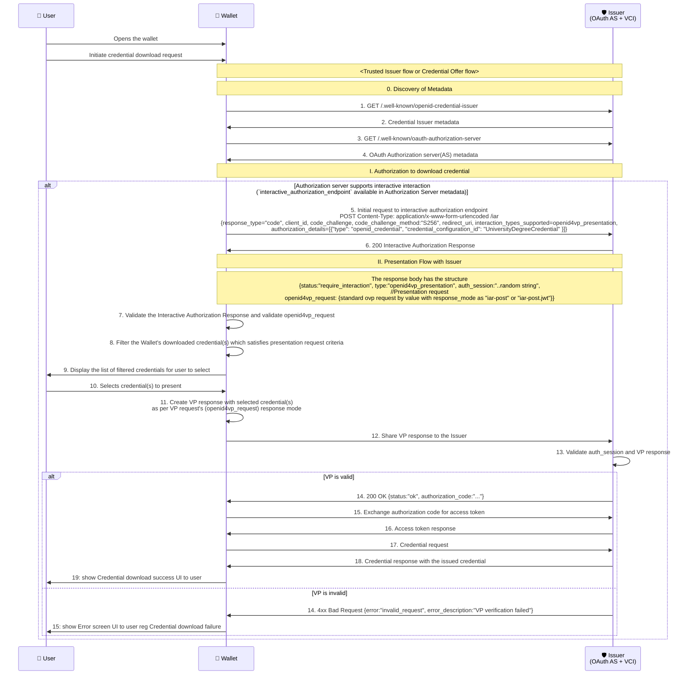
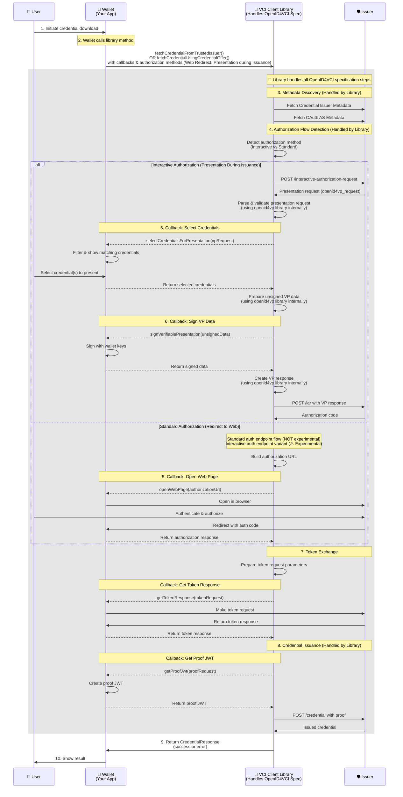

# Presentation During Issuance

When issuing credentials to a user, authentication or authorization is often required. The most common factor used is an OTP. However, using OTPs means the user must recall their identifier each time they access their credential. To simplify this, the specification allows submitting an existing credential to authorize the user for credential issuance — a process known as Presentation during Issuance.
In essence, it means presenting one credential to obtain another.

Example use cases:

- To issue a Student ID Credential, the user presents an Enrollment Credential issued by the educational institution.
- To issue a Health Insurance Credential, the user presents an Identity Credential issued by a government authority.

**This document covers**: 
- What Presentation During Issuance is 
- how the Inji VCI Client Library implements OpenID4VCI v1.1 to support it
- step-by-step integration guidance for wallet developers.

## Table of Contents

- [Specification References](#specification-references)
- [Clarifications](#clarifications)
- [Future scope](#future-scope)
- [Pre-requisites](#pre-requisites)
- [Terminologies](#terminologies)
- [Credential Download with Presentation During Issuance - Process Flow](#credential-download-with-presentation-during-issuance---process-flow)
  - [Actors involved](#actors-involved)
  - [Sequence of interactions between entities for Presentation during Issuance flow](#sequence-of-interactions-between-entities-for-presentation-during-issuance-flow)
- [Credential Download Via Inji VCI Client Library - Integration Guide](#credential-download-via-inji-vci-client-library---integration-guide)
  - [Simplified Integration Flow](#simplified-integration-flow)
  - [Detailed Steps](#detailed-steps)

## Specification References

- [OpenID4VCI v1.1 Specification Commit](https://github.com/openid/OpenID4VCI/blob/31636e9bb7f0eef6933175e1e41c78ce79a69783/1.1/openid-4-verifiable-credential-issuance-1_1.md)
- [OpenID for Verifiable Presentations 1.0](https://openid.net/specs/openid-4-verifiable-presentations-1_0.html)
- [OAuth 2.0 Pushed Authorization Requests](https://www.rfc-editor.org/info/rfc9126)
- [The OAuth 2.0 Authorization Framework](https://www.rfc-editor.org/info/rfc6749)
- [DIF Presentation Exchange](https://identity.foundation/presentation-exchange/)

## Clarifications

- The OVP request received is no different from current OVP request (DIF Presentation Exchange) structure followed in Wallet. ([Draft 23 OpenID4VP specification using DIF presentation exchange](https://openid.net/specs/openid-4-verifiable-presentations-1_0-ID3.html#name-dif-presentation-exchange-2).)
- The VP response created is also similar to the current VP response (DIF Presentation Exchange) structure followed in Wallet. ([Draft 23 VP response (Presentation Exchange)](https://openid.net/specs/openid-4-verifiable-presentations-1_0-ID3.html#name-examples-presentation-excha).)
- Wallet supports for `openid4vp_presentation` interaction type only. Other interaction types like `redirect_to_web` will be supported in the future.

> **⚠️ Important - Experimental API Notice:**
> 
> The **Redirect to Web flow via the interactive authorization endpoint** (`interactive_authorization_endpoint`) is exposed as an **experimental API** and is expected to be improved in future releases.
> 
> However, the **standard Redirect to Web flow via the authorization endpoint** (`authorization_endpoint`) is **NOT experimental** and is fully supported as per the OpenID4VCI specification.

### Future scope

- `redirect_to_web` interaction type support during issuance.

## Pre-requisites

- The Issuer supporting the Interactive Authorization Request Endpoint as per the specification.

## Terminologies

- OAuth AS: OAuth Authorization Server
- VCI: Verifiable Credential Issuer
- OVP: OpenID for Verifiable Presentations
- VP: Verifiable Presentation
- IAR: Interactive Authorization Request

## Credential Download with Presentation During Issuance - Process Flow

### Actors involved

1. **User**: The individual requesting the credential.
2. **Wallet - Inji Wallet**: The digital wallet application used by the user to manage credentials.
3. **Issuer (OAuth AS + VCI)**: The entity responsible for issuing the credential, which also acts as an OAuth Authorization Server and Verifiable Credential Issuer.

### Sequence of interactions between entities for Presentation during Issuance flow




## 📱 Credential Download Via Inji VCI Client Library - Integration Guide

This section provides a simplified integration perspective, highlighting what the Wallet needs to implement versus what the VCI Client Library handles internally.

### Simplified Integration Flow

The following sequence diagram shows the integration from the Wallet's perspective. The diagram emphasizes that the **VCI Client Library handles all OpenID4VCI specification complexity internally**, and the Wallet only needs to:
1. Call the library methods
2. Implement simple callback functions for wallet-specific operations



### Detailed Steps:

The following steps provide a detailed breakdown of the credential download process shown in the Integration Guide diagram above. Each step is labeled to indicate whether it's **handled by the library** automatically or requires a **wallet callback** for wallet-specific operations.

#### 1. Initiate Credential Download Request

- The user initiates a credential download request in the Wallet application.
- For the Trusted Issuer flow, the User opens the wallet and selects a credential to download from the list of trusted issuers.
- For the Credential Offer flow, the User opens the wallet and scans the QR code to download using a received credential offer.

#### 2. Fetch Credential from Trusted Issuer or Using Credential Offer

Based on the chosen flow, the Wallet invokes either `fetchCredentialFromTrustedIssuer` or `fetchCredentialUsingCredentialOffer` method from the _inji-vci-client_ library, providing the necessary parameters and callbacks to handle the credential download process.

```kotlin
    fetchCredentialFromTrustedIssuer(
        credentialIssuer,
        credentialConfigurationId,
        clientMetadata,
        getTokenResponse,
        getProofJwt,
        authorizations: listOf(
            AuthorizationMethod.PresentationDuringIssuance(selectCredentialsForPresentation, signVerifiablePresentation, signatureSuite),
            AuthorizationMethod.RedirectToWeb(openWebPage)
        )
    )
                // OR
    fetchCredentialUsingCredentialOffer(
        credentialOffer,
        clientMetadata,
        getTxCode,
        authorizations: listOf(
          AuthorizationMethod.PresentationDuringIssuance(selectCredentialsForPresentation, signVerifiablePresentation, signatureSuite),
          AuthorizationMethod.RedirectToWeb(openWebPage)
        ),
        getTokenResponse,
        getProofJwt,
        onCheckIssuerTrust,
        downloadTimeoutInMillis
    )
```

**Notes:**

- VCIClient exposes the AuthorizationMethod class. When consumers use this class, all OVP-related processing is handled internally by using `inji-openid4vp` library.
- The wallet only needs to supply the required wallet communications via callbacks for credential selection, signing data during VP creation and signature suite used for signing.
- The library automatically detects the appropriate authorization flow based on the issuer's metadata and the authorization methods provided by the wallet.

#### 3. Metadata Discovery (Handled by Library)

- The _inji-vci-client_ performs discovery by fetching the Issuer Metadata and OAuth Authorization Server Metadata.
- This step is completely automated by the library and requires no wallet intervention.

#### 4. Authorization Flow Detection and Execution (Handled by Library)

- The library checks if the Authorization Server supports interactive authorization by looking for the `interactive_authorization_endpoint` in the Authorization Server metadata.
- If not available, it uses the `authorization_endpoint` available in the metadata for the standard authorization process.
- The library selects the appropriate authorization method based on what the issuer supports and what the wallet has configured in the `authorizations` list.

##### **Interactive Authorization Flow (Presentation During Issuance):**

**Note:** The Current implementation supports only Interactive Authorization flow for Presentation during Issuance

**Step 4a: Initial Interactive Authorization Request (Handled by Library)**

- The _inji-vci-client_ makes an initial request to the interactive authorization endpoint with the following details:

```shell
POST Content-Type: application/x-www-form-urlencoded /iar
{
  "response_type": "code",
  "client_id": "<client_id>",
  "code_challenge": "<code_challenge>",
  "code_challenge_method": "S256",
  "redirect_uri": "<redirect_uri>",
  "interaction_types_supported": "openid4vp_presentation",
  "authorization_details": [
    {
      "type": "openid_credential",
      "credential_configuration_id": "UniversityDegreeCredential"
    }
  ]
}
```

**Step 4b: Receive Presentation Request (Handled by Library)**

- The Issuer responds with a 200 OK response, indicating that interactive authorization is required, along with the OVP request in the response body. 
- The OVP request has the response mode as either `iar_post` or `iar_post.jwt`.
- The OVP request has the following structure:

```shell
{
  "status": "require_interaction",
  "type": "openid4vp_presentation",
  "auth_session": "..random string",
  "openid4vp_request": {
    {
      "client_id": "did:example:123456",
      "response_uri": "https://client.example.com/post",
      "response_type": "vp_token",
      "response_mode": "iar_post",
      "presentation_definition": {
        "input_descriptors": [
          {
            "id": "id card credential",
            "format": {
              "ldp_vc": {
                "proof_type": [
                  "Ed25519Signature2018"
                ]
              }
            },
            "constraints": {
              "fields": [
                {
                  "path": [
                    "$.type"
                  ],
                  "filter": {
                    "type": "string",
                    "pattern": "IDCardCredential"
                  }
                }
              ]
            }
          }
        ]
      },
      "nonce": "...nonce",
      "state" : "...state",
      "id": "vp token example",
    }
  }
}
```

**Step 4c: Validate Presentation Request (Handled by Library)**

- The _inji-vci-client_ validates the Interactive Authorization Response and the OVP request using the `inji-openid4vp` library.

**Step 4d: Select Credentials for Presentation (Wallet Callback)**

- The _inji-vci-client_ invokes the Wallet's `selectCredentialsForPresentation` callback to select credentials for presentation.
- The Wallet processes the OVP request, filters the user's downloaded credentials based on the presentation request criteria, and displays the filtered credentials for the user to select.
- The user selects the credential(s) to present.
- The Wallet then returns the selected credentials to the _inji-vci-client_.

**Step 4e: Prepare VP Data (Handled by Library)**

- The _inji-vci-client_ prepares the data for signing using the `inji-openid4vp` library, passing the selected credentials.
- The `inji-openid4vp` library returns the unsigned data to the _inji-vci-client_.

**Step 4f: Sign VP Data (Wallet Callback)**

- The _inji-vci-client_ invokes the Wallet's `signVerifiablePresentation` callback to sign the data for VP creation.
- The Wallet signs the data using its cryptographic keys and returns the signed data to the _inji-vci-client_.

**Step 4g: Create VP Response (Handled by Library)**

- The _inji-vci-client_ creates the VP response using the `inji-openid4vp` library.
- The `inji-openid4vp` library returns the VP response as a Map<String, Any> to the _inji-vci-client_.

**Step 4h: Submit VP Response (Handled by Library)**

- The _inji-vci-client_ prepares the response to be sent to the Issuer's /iar endpoint, including the VP response and auth_session.
- The _inji-vci-client_ shares the VP response to the Issuer's /iar endpoint:

```shell
POST /iar
Content-Type - application/x-www-form-urlencoded
{
  "auth_session": "...",
  "openid4vp_presentation": {
    "vp_token": <VP Token>,
    "presentation_submission": <Presentation Submission>
   }
}
```

**Step 4i: Receive Authorization Code or Error (Handled by Library)**

- The Issuer validates the auth_session and VP response.

  - **If the VP is valid**, the Issuer responds with a 200 OK response, including the authorization code in the response body. The _inji-vci-client_ extracts the authorization code from the response and proceeds to exchange it for an access token.

  ```shell
  {
    "status": "ok",
    "code": "..."
  }
  ```

  - **If the VP is invalid**, the Issuer responds with a 4xx Bad Request error, indicating that the VP verification failed. The _inji-vci-client_ propagates the error to the Wallet, which then shows an error screen to the user regarding the credential download failure.
    ```shell
    {
      "error": "invalid_request",
      "error_description": "VP verification failed"
    }
    ```

---

> **📌 Important Clarification on Redirect to Web Authorization:**
> 
> The library supports Redirect to Web authorization via **two different endpoints**:
> 
> | Endpoint Type                          | Endpoint Name                        | Status                                   |
> |----------------------------------------|--------------------------------------|------------------------------------------|
> | **Standard Authorization Endpoint**    | `authorization_endpoint`             | ✅ **Fully Supported** (NOT experimental) |
> | **Interactive Authorization Endpoint** | `interactive_authorization_endpoint` | ⚠️ **Experimental API**                  |
> 
> The library automatically selects the appropriate endpoint based on the issuer's metadata. When using `AuthorizationMethod.RedirectToWeb`, the standard authorization endpoint flow is stable and production-ready, while the interactive authorization endpoint variant is experimental and may change in future releases.

---

##### **Standard Authorization Flow (Redirect to Web via Authorization Endpoint):**

**Step 4a: Build Authorization URL (Handled by Library)**

- If the Authorization Server does not support interactive authorization, the _inji-vci-client_ builds the authorization request URL with the required parameters:

```shell
/authorize?
  response_type=code
  &client_id=s6BhdRkqt3
  &code_challenge=E9Melhoa2OwvFrEMTJguCHaoeK1t8URWbuGJSstw-cM
  &code_challenge_method=S256
  &scope=sample_vc
  &state=af0ifjsldkj
  &nonce=xyzABC123
  &redirect_uri=https%3A%2F%2Fclient.example.org%2Fcb HTTP/1.1
```

**Step 4b: Open Authorization Page (Wallet Callback)**

- The library invokes the Wallet's `openWebPage` callback with the authorization URL.
- The Wallet opens the authorization URL in a web browser (in-app browser or system browser).

**Step 4c: User Authentication and Authorization**

- The user authenticates and authorizes the request in the web browser.

**Step 4d: Handle Authorization Response (Wallet Callback)**

- **If authentication and authorization are successful**, the Issuer redirects to the redirect_uri with the authorization response, including the authorization code:

```shell
{
  "status": "ok",
  "code": "..."
}
```

- The Wallet captures the redirect response and returns the authorization response to the _inji-vci-client_. 
- The _inji-vci-client_ extracts the authorization code from the response and proceeds to exchange it for an access token.

- **If authentication and authorization fail**, the Issuer responds with an error response:

```shell
{
  "error": "access_denied",
  "error_description": "The resource owner or authorization server denied the request."
}
```

- The _inji-vci-client_ propagates the error to the Wallet, which then shows an error screen to the user regarding the credential download failure.


#### 5. Exchange Authorization Code for Access Token (Library + Wallet Callback)

**Step 5a: Prepare Token Request (Handled by Library)**

- The _inji-vci-client_ prepares the token request parameters for exchanging the authorization code for an access token.

**Step 5b: Request Token (Wallet Callback)**

- The _inji-vci-client_ invokes the Wallet's `getTokenResponse` callback function with the token request parameters.
- The token request includes:

```kotlin
TokenRequest(
  grantType = GrantType.AUTHORIZATION_CODE,
  tokenEndpoint = "https://issuer.example.com/token",
  authCode = "sample_auth_code", // Authorization code received from previous step
  preAuthCode = null,
  txCode = null,
  clientId = "client_123",
  redirectUri = "https://client.example.com/cb",
  codeVerifier = "sample_code_verifier"
)
```

**Step 5c: Return Token Response (Wallet Callback)**

- The Wallet makes an HTTP POST request to the token endpoint with the provided parameters.
- The Issuer responds with the access token response
- The Wallet returns the token response to the _inji-vci-client_.
```kotlin
TokenResponse(
    accessToken = "sample_access_token",
    tokenType = "Bearer",
    expiresIn = 86400,
    cNonce = "tZignsnFbp",
    cNonceExpiresIn = 86400
)
```
- The library extracts and stores the access token and c_nonce for the credential request.

#### 6. Credential Request and Issuance (Library + Wallet Callback)

**Step 6a: Prepare Credential Request (Handled by Library)**

- The _inji-vci-client_ prepares the credential request with the required parameters.

**Step 6b: Get Proof JWT (Wallet Callback)**

- The library invokes the Wallet's `getProofJwt` callback function to get the proof JWT to attach in the credential request.
- The Wallet creates the proof JWT (signed with the wallet's key, including the c_nonce from the token response) and returns it to the _inji-vci-client_.

**Step 6c: Request Credential (Handled by Library)**

- The _inji-vci-client_ requests the credential from the Issuer, attaching the proof JWT and access token.

**Step 6d: Receive Credential (Handled by Library)**

- The Issuer validates the proof JWT and issues the credential.
- The Issuer responds to the _inji-vci-client_ with the credential:

```shell
# Successful Credential Response
{
  "credential": <issued_credential>,
}
```

**Step 6e: Return Result to Wallet**

- The _inji-vci-client_ returns the CredentialResponse (success or error) to the Wallet.
- If successful, the Wallet stores the credential and shows a success message to the user.
- If there's an error, the Wallet shows an appropriate error screen to the user.


### What the Library Handles (Abstracted Away)

The VCI Client Library internally manages all the complex OpenID4VCI specification requirements:

- **Metadata Discovery**: Fetches and parses issuer and OAuth AS metadata
- **Authorization Flow Selection**: Automatically detects and handles interactive vs standard authorization as per the Wallet's supported authorizations provided.
- **Presentation Request Validation**: Validates OpenID4VP requests using `inji-openid4vp` library
- **VP Creation**: Prepares, signs, and formats Verifiable Presentations
- **Protocol Compliance**: Ensures all requests follow OpenID4VCI v1.1 specification
- **Token Exchange**: Manages authorization code to access token exchange
- **Credential Request Formatting**: Prepares properly formatted credential requests with proofs
- **Error Handling**: Translates specification errors into actionable results

### What the Wallet Must Implement (Integration Points)

The Wallet only needs to provide simple callback functions for wallet-specific operations:

1. **`openWebPage`**
   1. Required for web-view-based authorization flow
   2. Open authorization URL in browser for redirect-based auth
   3. **⚠️ Experimental Notice**: Only the Redirect to Web flow **via interactive authorization endpoint** (`interactive_authorization_endpoint`) is experimental. The standard Redirect to Web flow **via authorization endpoint** (`authorization_endpoint`) is fully supported and NOT experimental.
2. **`selectCredentialsForPresentation`**: 
   1. Required for Presentation during Issuance authorization flow
   2. Filter and let user select credentials matching the presentation request
3. **`signVerifiablePresentation`**: Sign data using wallet's cryptographic keys
4. **`getTokenResponse`**: Make HTTP POST request to token endpoint
5. **`getProofJwt`**: Create and sign proof JWT for credential request

