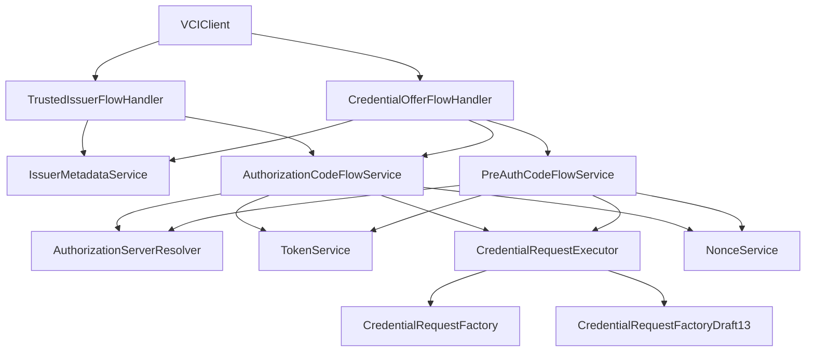
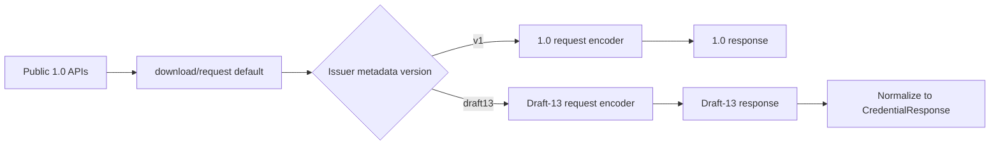
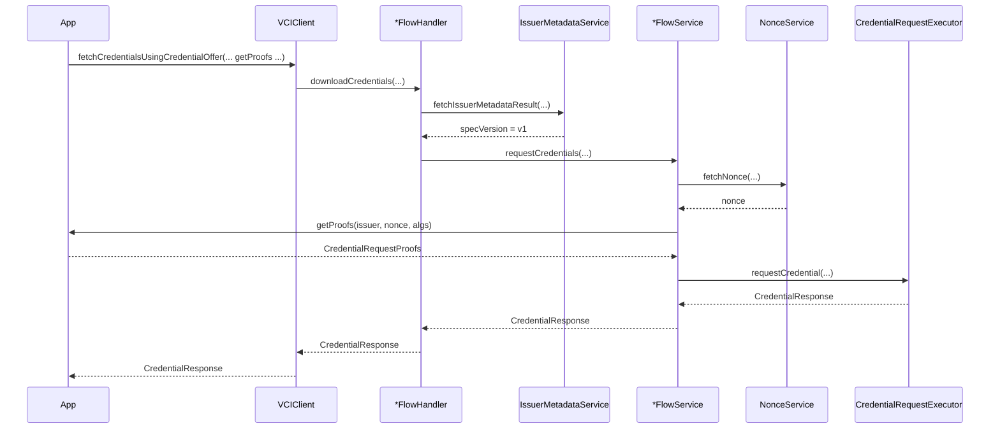
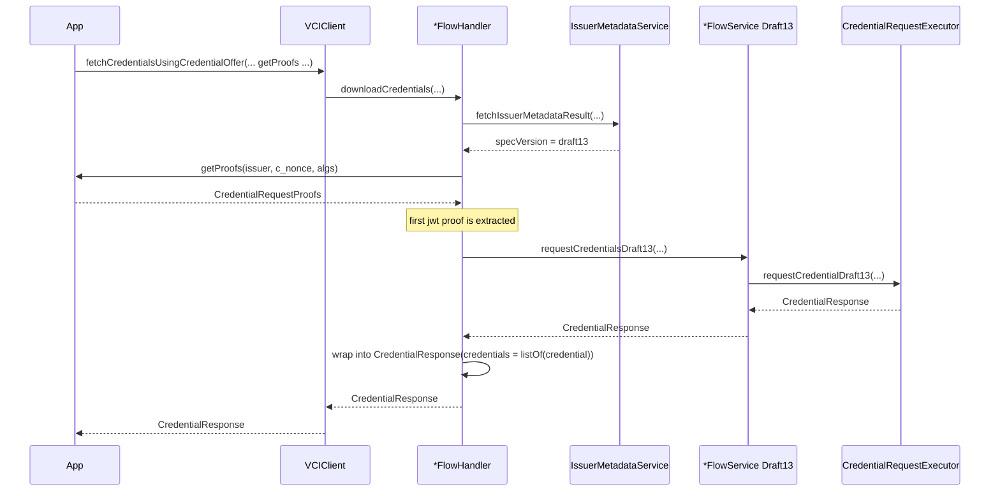

# ADR-0001: OpenID4VCI 1.0 Migration with Draft-13 Compatibility

- Status: Accepted
- Date: 2026-03-30

## Context

`VCIClient` originally implemented the OpenID4VCI specification Draft-13:

- single proof callback
- single credential response
- no issuer nonce endpoint handling
- request/response models shaped around Draft-13

With the release of the OpenID4VCI specification version 1.0, this library needs to be updated to support it, while maintaining interoperability with issuers that are compliant with Draft-13.


The main constraints are:

- Draft-13 issuers must continue to work
- the public API should be smaller and easier to integrate
- 1.0 support should not require a heavy rewrite
- internal design should remain close to the existing flow/service/handler architecture

## Decision

The library exposes only the OpenID4VCI 1.0-shaped public APIs in `1.0.0` and keeps Draft-13 compatibility as an internal routing concern.

### Public API surface

The public credential download surface is:

- `fetchCredentialsUsingCredentialOffer(... getProofs = ProofsCallback ...) -> CredentialResponse`
- `fetchCredentialsFromTrustedIssuer(... getProofs = ProofsCallback ...) -> CredentialResponse`

Supporting public types:

- `CredentialRequestProofs`
- `CredentialResponse`
- `CredentialResponseDraft13`
- `OID4VCIVersion`

Removed from the public surface (1.0.0):

- All Draft-13-shaped `ProofJwtCallback` download APIs
- All deprecated wrapper methods (e.g. `requestCredentials(getProofJwt = ...)`)
- Low-level request APIs and their `IssuerMeta` DTO

### Internal routing rule

At the internal level:

- the default method names represent the primary 1.0 path
- explicit `Draft13` methods represent the compatibility path
- public APIs call the default methods and allow metadata-based routing
- when metadata indicates Draft-13, the compatibility route remains internal and the response is normalized before returning to the caller

This keeps the public contract centered on 1.0 while isolating Draft-13 behavior in clearly named compatibility methods.

## Public interface

### Callback contract

Public callback:

```kotlin
public typealias ProofsCallback = suspend (
    issuerUrl: String,
    cNonce: String?,
    proofSigningAlgorithmsSupported: List<String>
) -> CredentialRequestProofs
```

Current `CredentialRequestProofs` supports:

- `jwt: List<String>?`

This is intentionally plural at the wire boundary even though the current Draft-13 bridge still extracts the first JWT when talking to an older issuer.

### Response contract

Public response:

- `CredentialResponse`
- exposes plural `credentials`
- does not expose a synthetic singular `credential`

When the new API talks to a Draft-13 issuer, the internal Draft-13 response is normalized into:

```kotlin
CredentialResponse(credentials = listOf(draft13Credential), ...)
```

This keeps the public contract stable while avoiding a hybrid response model.

## Architecture

### Top-level component model



### Internal path ownership



## Detailed routing

### Public API routing

The public APIs are metadata-aware.

Flow:

1. fetch issuer metadata
2. resolve `specVersion`
3. if `v1`, use the primary 1.0 path
4. if `draft13`, use the Draft-13 path internally
5. return `CredentialResponse` to the caller in either case

### Version detection policy

`IssuerMetadataService` resolves `IssuerMetadata.specVersion` from issuer metadata hints.

Current implementation:

- if `nonce_endpoint` exists and is non-empty, classify as `v1`
- if credential configuration contains `credential_metadata`, classify as `v1`
- if credential configuration contains `display`, classify as `draft13`
- otherwise default to `v1`

Defaulting to `v1` is deliberate. The public API surface is 1.0-first, and inconclusive metadata should not force a legacy route.

## Request model changes

### Draft-13 request shape

Draft-13 requests use singular proof:

```json
{
  "format": "jwt_vc_json",
  "credential_definition": { "...": "..." },
  "proof": {
    "proof_type": "jwt",
    "jwt": "eyJ..."
  }
}
```

### 1.0 request shape

1.0 requests use plural proofs and identify the credential by configuration id:

```json
{
  "credential_configuration_id": "UniversityDegreeCredential",
  "proofs": {
    "jwt": ["eyJ..."]
  }
}
```

### Format handling

The request-structure split is now explicit:

- the 1.0 path is format-agnostic at the request body level
- all supported formats use the same `credential_configuration_id` + `proofs` request shape
- Draft-13 remains format-specific and continues to use per-format request builders
- this avoids reusing the 1.0 request model inside the Draft-13 path and preserves Draft-13 builder validation

### Factory design

The request factories are separated by protocol version and request model:

- `CredentialRequestFactory`
- `CredentialRequestFactoryDraft13`

The 1.0 factory is now isolated to the 1.0 request model:

- validates that the proof collection is not empty
- builds the request body using `credential_configuration_id` and `proofs`

The Draft-13 factory is also isolated to the legacy request model:

- validates that the proof is a non-empty JWT proof
- dispatches to existing per-format Draft-13 builders
- keeps Draft-13-specific request validation inside those builders

This preserves the pre-migration Draft-13 validation behavior while keeping the 1.0 request path aligned with the current `credential_configuration_id`-based contract.

## Response model changes

### Draft-13 response shape

```json
{
  "credential": { "...": "..." }
}
```

### 1.0 response shape

```json
{
  "credentials": [
    { "...": "..." }
  ]
}
```

### Normalization policy

- do not synthesize `credential` inside `CredentialResponse`
- do not expose a hybrid response model
- if the public API talks to a Draft-13 issuer, wrap the Draft-13 credential into a one-item `credentials` array

## Nonce handling

OpenID4VCI 1.0 introduces explicit nonce endpoint support.

Nonce resolution is now:

1. for Draft-13 route:
   - use `NonceService.extractNonceFromTokenResponse()` to extract `c_nonce` from the token response
   - fail if the Draft-13 flow requires a nonce and it is missing
2. for 1.0 route:
   - fetch nonce using `NonceService.fetchNonce()` from issuer metadata `nonce_endpoint`

This keeps the old route behavior intact while enabling 1.0 proof generation.


## Sequences

### Sequence: new API on 1.0 issuer



### Sequence: new API on Draft-13 issuer



## Consequences

### Positive

- existing integrations are preserved
- legacy API behavior is stable and explicit
- new API exposes a cleaner 1.0 contract
- future removal of Draft-13 is straightforward because compatibility code is isolated behind `Draft13` methods
- request and response wire-model differences are explicit instead of hidden

### Negative

- the public API may still run on Draft-13 internally, which adds normalization logic
- metadata detection is heuristic-based, not negotiated through an explicit issuer version field

## Rejected alternatives

### One API shape for both specs

Rejected because:

- proof callback contract changed materially
- response model changed materially
- a shared public contract would either hide protocol differences or fabricate fields

### Two totally separate end-to-end stacks

Rejected because:

- it would duplicate orchestration logic
- cleanup later would be harder
- most differences are at protocol edges, not the entire flow

### Make Draft-13 the primary internal naming

Rejected because:

- the target architecture is OpenID4VCI 1.0
- cleanup becomes harder if the compatibility path remains the default mental model

## Migration and cleanup path

Current intended end state:

1. keep the public API surface aligned to OpenID4VCI 1.0
2. keep Draft-13 behavior behind explicit `Draft13` methods
3. retain response normalization only while Draft-13 support is needed
4. when Draft-13 support is no longer needed:
   - remove `Draft13` methods
   - remove normalization logic

## Implementation notes

Primary files involved:

- `kotlin/vci-client/src/main/java/io/mosip/vciclient/VCIClient.kt`
- `kotlin/vci-client/src/main/java/io/mosip/vciclient/credentialOffer/CredentialOfferFlowHandler.kt`
- `kotlin/vci-client/src/main/java/io/mosip/vciclient/trustedIssuer/TrustedIssuerFlowHandler.kt`
- `kotlin/vci-client/src/main/java/io/mosip/vciclient/authorizationCodeFlow/AuthorizationCodeFlowService.kt`
- `kotlin/vci-client/src/main/java/io/mosip/vciclient/preAuthCodeFlow/PreAuthCodeFlowService.kt`
- `kotlin/vci-client/src/main/java/io/mosip/vciclient/credential/request/CredentialRequestFactory.kt`
- `kotlin/vci-client/src/main/java/io/mosip/vciclient/credential/request/CredentialRequestFactoryDraft13.kt`
- `kotlin/vci-client/src/main/java/io/mosip/vciclient/credential/request/types/LdpVcCredentialRequestDraft13.kt`
- `kotlin/vci-client/src/main/java/io/mosip/vciclient/credential/request/types/JwtVcCredentialRequestDraft13.kt`
- `kotlin/vci-client/src/main/java/io/mosip/vciclient/credential/request/types/MsoMdocCredentialRequestDraft13.kt`
- `kotlin/vci-client/src/main/java/io/mosip/vciclient/credential/request/types/SdJwtCredentialRequestDraft13.kt`
- `kotlin/vci-client/src/main/java/io/mosip/vciclient/credential/response/CredentialResponse.kt`
- `kotlin/vci-client/src/main/java/io/mosip/vciclient/credential/response/CredentialResponseDraft13.kt`
- `kotlin/vci-client/src/main/java/io/mosip/vciclient/proof/CredentialRequestProofs.kt`
- `kotlin/vci-client/src/main/java/io/mosip/vciclient/constants/CallbackTypes.kt`
- `kotlin/vci-client/src/main/java/io/mosip/vciclient/issuerMetadata/IssuerMetadataService.kt`
- `kotlin/vci-client/src/main/java/io/mosip/vciclient/nonce/NonceService.kt`
- `kotlin/vci-client/src/main/java/io/mosip/vciclient/constants/OID4VCIVersion.kt`
